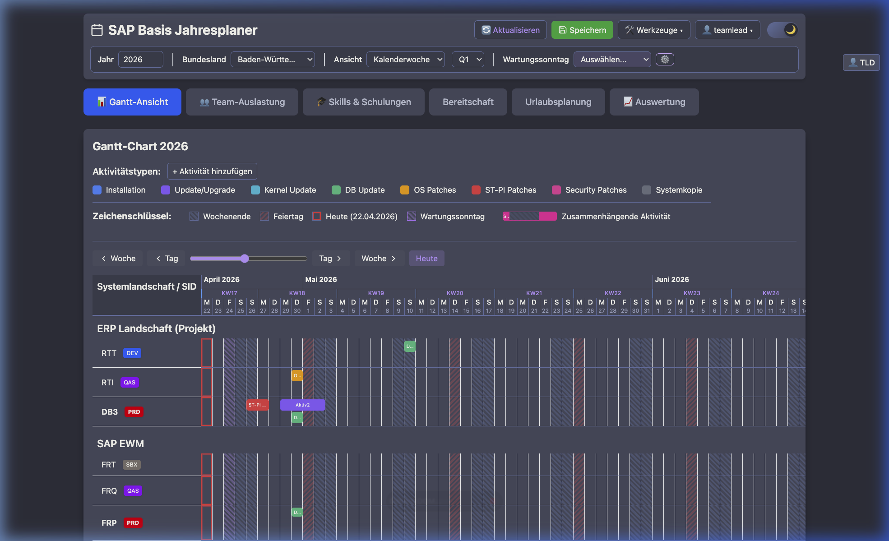

# SAP Basis Jahresplaner Copyright 2026 Optima Solutions GmbH

Version **0.1.4** — Multi-User-fähiges Planungstool mit SQLite-Backend. Die Anwendung ermöglicht es mehreren Benutzern, die gleiche Datenbank von verschiedenen Computern aus zu nutzen, unterstützt rollenbasierten Zugriff (Teamlead / Admin / User) und bietet eine REST-API für die Verwaltung von Planungsdaten.



## Inhaltsverzeichnis

- [Überblick & Architektur](#überblick--architektur)
- [Neue Features (v0.1.4)](#neue-features-v014)
- [Installation & Start (Lokal)](#installation--start-lokal)
- [Produktions-Deployment](#produktions-deployment)
- [HTTPS aktivieren](#https-aktivieren)
- [Benutzerverwaltung & Sicherheit](#benutzerverwaltung--sicherheit)
- [Betrieb & Wartung](#betrieb--wartung)
- [Technische Referenz (API & DB)](#technische-referenz-api--db)
- [Fehlerbehebung](#fehlerbehebung)

---

## Überblick & Architektur

Die Anwendung wurde von einer rein lokalen `localStorage`-Lösung auf eine Client-Server-Architektur umgestellt.

### Logische Architektur

```
┌─────────────────────┐      HTTP/REST      ┌─────────────────────┐
│                     │  ←────────────────→ │                     │
│   React Frontend    │                     │   Express.js API    │
│   (Browser)         │   JSON Responses    │   (Node.js)         │
│                     │                     │   Port 3232         │
└─────────────────────┘                     └──────────┬──────────┘
                                                       │
                                                       │ better-sqlite3
                                                       ▼
                                            ┌─────────────────────┐
                                            │                     │
                                            │   SQLite Datenbank  │
                                            │   (sap-planner.db)  │
                                            │                     │
                                            └─────────────────────┘
```

### Deployment-Architektur

In einer Produktionsumgebung greifen mehrere Clients über das Netzwerk auf den Server zu.

```
┌─────────────────┐     ┌─────────────────┐
│   Client 1      │     │   Client 2      │ ...
│ (Browser/HTML)  │     │ (Browser/HTML)  │
└────────┬────────┘     └────────┬────────┘
         │                       │
         └───────────┬───────────┘
                     │
        ┌────────────▼────────────┐
        │     Server Machine      │
        │  ┌──────────────────┐   │
        │  │   Node.js API    │   │
        │  │   Port: 3232     │   │
        │  └────────┬─────────┘   │
        │           │             │
        │  ┌────────▼─────────┐   │
        │  │   SQLite DB      │   │
        │  └──────────────────┘   │
        └─────────────────────────┘
```

### Dateistruktur

```
Planung mit DB/
├── README.md              # Diese Dokumentation
├── sap-planner.html       # Frontend (React)
├── server.js              # Backend-Server (Node.js/Express)
├── manage-users.js        # CLI-Tool für Benutzerverwaltung
├── package.json           # npm-Projektdatei
├── sap-planner.db         # SQLite-Datenbank (wird automatisch erstellt)
└── node_modules/          # npm-Abhängigkeiten
```

---

## Neue Features (v0.1.4)

### 🌙 Dark Mode

Jeder Benutzer kann zwischen hellem und dunklem Design wechseln. Der Toggle befindet sich im Header (Sonne/Mond-Symbol). Die Einstellung wird **pro Benutzer** in der Datenbank gespeichert und automatisch bei der Anmeldung wiederhergestellt.

### 👁️ Per-User Gantt-Sichtbarkeit

Die Checkbox „Sichtbar in Gantt" speichert die Auswahl **pro Benutzer**. Jeder Benutzer kann individuell entscheiden, welche SIDs im Gantt-Chart angezeigt werden, ohne die Ansicht anderer Benutzer zu beeinflussen.

### 📊 CSV Export für alle Benutzer

Der CSV Export steht nun **allen Benutzern** zur Verfügung (nicht nur Admin/Teamlead):

- Exportiert nur die SIDs, die für den aktuellen Benutzer **„Sichtbar in Gantt"** sind
- Dateiname mit Zeitstempel: `SAP-Basis-Planung-<Jahr>-<YYYYMMDD-HHMMSS>.csv`
- Spalten: Systemlandschaft, SID, PRD, Aktivitätstyp, Sub-Aktivität, Startdatum, Dauer, Enddatum, **Startzeit**, **Endzeit**
- UTF-8 mit BOM, Semikolon als Trennzeichen (Excel-kompatibel)

### 📅 Jahresbasierte Gantt-Ansicht

Die Kalenderwochenansicht basiert jetzt auf dem **gewählten Jahr** statt dem aktuellen Datum. Beim Wechsel des Jahres springt die Ansicht automatisch auf den 1. Januar des neuen Jahres.

### 🔧 Wartungssonntag-Zentrierung

Bei Auswahl eines Wartungssonntags scrollt die Gantt-Ansicht automatisch so, dass der gewählte Termin **mittig** im sichtbaren Bereich angezeigt wird. Falls nicht bereits aktiv, wird automatisch die Wochenansicht aktiviert.

### 🔐 Weitere Verbesserungen

- **Login:** Benutzername ist nicht mehr case-sensitiv (z.B. „kevin" = „Kevin")
- **Team Management Tab:** Nur sichtbar für Teamlead und Admin
- **Bundesland-Dropdown:** Kein Dropdown-Pfeil mehr für normale Benutzer (read-only)

---

## Installation & Start (Lokal)

Voraussetzung: Node.js Version 20 oder höher (LTS).

1. **Projektverzeichnis öffnen:**
   ```bash
   cd "/Pfad/zu/Planung mit DB"
   ```

2. **Abhängigkeiten installieren:**
   ```bash
   npm install
   ```

3. **Server starten:**
   ```bash
   npm start
   # Oder für Entwicklung mit Auto-Reload:
   npm run dev
   ```
   Der Server startet auf **http://localhost:3232**.

4. **Anwendung öffnen:**
   Öffnen Sie `http://localhost:3232` im Browser.

---

## Start with Docker (Recommended)

Der einfachste Weg, die Anwendung zu starten, ist die Nutzung von Docker.

### Voraussetzungen
*   Docker & Docker Compose (oder Docker Desktop)
*   Git

### Schnellstart

1.  **Code herunterladen:**
    ```bash
    git clone <repository-url> sap-planner
    cd sap-planner
    ```

2.  **Container bauen:**
    ```bash
    docker build -t sap-planner .
    ```

3.  **Container starten:**
    ```bash
    docker run -d \
      --name sap-planner \
      -p 3232:3232 \
      -v "$(pwd)/data":/app/data \
      -e DB_PATH=/app/data/sap-planner.db \
      sap-planner
    ```

    > [!WARNING]
    > **macOS iCloud Users:** Falls Ihr Projekt in `~/Library/Mobile Documents/...` liegt, kann es zu `operation not permitted` Fehlern kommen.
    > **Lösung:** Verschieben Sie das Projekt in einen lokalen Ordner (z.B. `~/Documents`) oder geben Sie Docker "Full Disk Access" in den Systemeinstellungen.

4.  **Zugriff:**
    Die Anwendung ist nun unter [http://localhost:3232](http://localhost:3232) erreichbar.

---

## Produktions-Deployment

Für den dauerhaften Betrieb auf einem Server (Windows, Linux, macOS) im Netzwerk.

### 1. Server vorbereiten
Kopieren Sie folgende Dateien in ein Verzeichnis auf dem Server (z.B. `/opt/sap-basis-planner`):
- `server.js`
- `package.json`
- `sap-planner.html` (optional, zum Hosten über den Server)

Führen Sie im Serververzeichnis `npm install` aus.

### 2. Server als Dienst starten (PM2)
Es wird empfohlen, `pm2` zu verwenden, damit der Server nach Abstürzen oder Neustarts automatisch wieder hochfährt.

```bash
# PM2 installieren
npm install -g pm2

# Server starten
pm2 start server.js --name "sap-planner"

# Autostart bei Systemstart einrichten
pm2 startup
pm2 save
```

### 3. Firewall konfigurieren
Stellen Sie sicher, dass Port `3232` (TCP) erreichbar ist.

*   **Linux (ufw):** `sudo ufw allow 3232/tcp`
*   **Windows:** Neue eingehende Regel für Port 3232 TCP erstellen.

### 4. Client-Konfiguration (Frontend)
Damit die Clients den Server finden, muss die `sap-planner.html` angepasst werden.

1.  Öffnen Sie `sap-planner.html` in einem Editor.
2.  Suchen Sie die Zeile `this.baseUrl = ...` (ca. Zeile 86).
3.  Ändern Sie die URL auf die IP-Adresse oder den Hostnamen des Servers:
    ```javascript
    // Produktion:
    this.baseUrl = 'http://192.168.1.100:3232';
    // Oder:
    this.baseUrl = 'http://sap-planner.firma.local:3232';
    ```
4.  Verteilen Sie die angepasste HTML-Datei an die Benutzer oder hosten Sie sie zentral.

---

## HTTPS aktivieren

Der Server erkennt automatisch Zertifikatsdateien (`server.key` und `server.cert`) und startet dann als HTTPS-Server. Es ist **keine Code-Änderung** nötig.

### Option A: Direktes HTTPS (Self-Signed Zertifikat)

Empfohlen für den **Intranet-Einsatz** (z.B. im Firmennetz). Browser zeigen eine einmalige Warnung an.

**1. Zertifikat erzeugen (einmalig auf dem Server):**

```bash
mkdir -p /opt/sap-planner/certs
openssl req -x509 -nodes -days 365 \
  -newkey rsa:2048 \
  -keyout /opt/sap-planner/certs/server.key \
  -out /opt/sap-planner/certs/server.cert \
  -subj "/CN=sap-planner/O=Optima Solutions"
```

**2. Docker Compose anpassen:**

Mounten Sie die Zertifikate als read-only Volumes:

```yaml
volumes:
  - sap-planner-data:/app/data
  - /opt/sap-planner/certs/server.key:/app/server.key:ro
  - /opt/sap-planner/certs/server.cert:/app/server.cert:ro
```

**3. Container neu starten:**

Der Server erkennt die Dateien automatisch:
```
SAP Basis Jahresplaner Server (HTTPS)
Server läuft auf: https://localhost:3232
```

**Ohne Docker (lokal):** Legen Sie `server.key` und `server.cert` direkt neben `server.js` ab.

### Option B: Reverse Proxy (Nginx + Let's Encrypt)

Für **öffentlich erreichbare** Installationen mit gültigem SSL-Zertifikat. Erfordert eine Domain und Port 80/443 Zugang. Richten Sie einen Nginx- oder Traefik-Container als Reverse Proxy ein.

---

## Benutzerverwaltung & Sicherheit

### Benutzerrollen

| Feature | Teamlead (Superuser) | Admin | User |
|---|---|---|---|
| **Daten anzeigen** | ✅ | ✅ | ✅ |
| **SIDs auf-/zuklappen** | ✅ | ✅ | ✅ |
| **Dark Mode** | ✅ | ✅ | ✅ |
| **Gantt-Sichtbarkeit (pro User)** | ✅ | ✅ | ✅ |
| **CSV Export** | ✅ | ✅ | ✅ |
| **Landschaften verwalten** | ✅ | ✅ | ❌ |
| **SIDs verwalten** | ✅ | ✅ | ❌ |
| **Aktivitäten verwalten** | ✅ | ✅ | ❌ |
| **Team-Zuordnung** | ✅ | ✅ | ❌ |
| **Einstellungen** | ✅ | ✅ | ❌ |
| **JSON Import/Export** | ✅ | ✅ | ❌ |
| **Backup / Restore** | ✅ | ✅ | ❌ |
| **Team Management Tab** | ✅ | ✅ | ❌ |
| **Benutzer erstellen** | ✅ Admin, User | ✅ User | ❌ |
| **Benutzer löschen** | ✅ Admin, User | ✅ User | ❌ |

> **Note:** Teamlead cannot be deleted. There must always be at least one Teamlead.

### Initialer Login
*   **User:** `teamlead` (Superuser, created on fresh install)
*   **Passwort:** `teamlead`
*   > ⚠️ **Wichtig:** Bitte ändern Sie das Passwort sofort nach dem ersten Login.

### CLI-Tool: `manage-users.js`
Sie können Benutzer auch über die Kommandozeile verwalten (ohne laufenden Server).

```bash
# Benutzer erstellen (Rollen: user, admin, teamlead)
node manage-users.js add <username> <password> <role>

# Alle Benutzer anzeigen
node manage-users.js list

# Benutzer löschen
node manage-users.js delete <username>
```

### Sicherheitsempfehlungen
1.  **HTTPS aktivieren:** Siehe [HTTPS aktivieren](#https-aktivieren). Der Server unterstützt HTTPS nativ über Zertifikatsdateien.
2.  **Passwörter:** Nutzen Sie starke Passwörter. Diese werden sicher mit `bcrypt` gehasht gespeichert.

---

## Betrieb & Wartung

### Backup

#### In-App Backup (empfohlen)

Die App bietet eine integrierte Backup/Restore-Funktion (Admin oder Teamlead Rolle erforderlich):

1. Navigieren Sie zum **Team Management** Tab
2. Scrollen Sie zur Sektion **💾 Backup / Wiederherstellung**
3. **📥 Backup exportieren** — lädt alle Daten als JSON-Datei herunter
4. **📤 Backup importieren** — stellt Daten aus einer JSON-Datei wieder her

> ⚠️ **Achtung:** Der Import **überschreibt** alle bestehenden Daten (nach Bestätigung).

**Enthaltene Daten:** Einstellungen, Aktivitätstypen, Teammitglieder, Wartungssonntage, Landschaften mit SIDs, Aktivitäten und Sub-Aktivitäten.  
**Nicht enthalten:** Benutzerkonten und Passwörter (aus Sicherheitsgründen).

#### Dateibasiertes Backup

Die gesamte Datenbank ist eine einzelne Datei: `sap-planner.db`.

```bash
# Manuelles Backup
cp sap-planner.db sap-planner-backup.db

# Automatisches Backup (Cron Beispiel)
0 2 * * * cp /opt/sap-basis-planner/sap-planner.db /backup/sap-planner-$(date +\%Y\%m\%d).db
```

### Server Monitoring
Status prüfen oder Logs einsehen:
```bash
pm2 status
pm2 logs sap-planner
```

---

## Technische Referenz (API & DB)

### Datenbankschema (Auszug)
*   **users:** `id, username, password_hash, role, dark_mode`
*   **landscapes:** `id, name, sort_order`
*   **sids:** `id, landscape_id, name, is_prd, visible_in_gantt, notes, sort_order`
*   **activities:** `sid_id, type_id, start_date, duration, start_time, end_time, team_member_id`
*   **sub_activities:** `activity_id, name, start_date, duration, start_time, end_time, team_member_id`
*   **user_sid_visibility:** `user_id, sid_id, visible` — Per-User Gantt-Sichtbarkeit
*   **team_members:** `id, name, abbreviation, working_days, training_days, to_plan_days`
*   **logs:** Audit-Log aller Aktionen.

### API Endpoints

| Method | Endpoint | Beschreibung |
|--------|----------|--------------|
| **Auth** | | |
| POST | `/api/auth/login` | Login |
| GET | `/api/auth/me` | Aktueller User Info |
| PUT | `/api/auth/dark-mode` | Dark Mode Einstellung speichern |
| **Settings** | | |
| GET | `/api/settings` | Einstellungen lesen |
| PUT | `/api/settings` | Einstellungen schreiben (Admin) |
| **Data** | | |
| GET | `/api/landscapes` | Lädt alle Daten (Landschaften, SIDs, Aktivitäten) |
| PATCH | `/api/sids/:id/visibility` | Gantt-Sichtbarkeit pro User setzen |
| POST | `/api/activities` | Neue Aktivität (Admin) |
| POST | `/api/import/json` | Import von Legacy JSON-Daten (Admin) |
| **Backup** | | |
| GET | `/api/backup/export` | Vollständiger Daten-Export als JSON (Admin) |
| POST | `/api/backup/import` | Daten-Import aus JSON-Backup (Admin) |
| **System** | | |
| GET | `/api/health` | Health-Check Endpoint (für Docker/Portainer) |

(Vollständige API-Liste siehe Quellcode `server.js`)

---

## Fehlerbehebung

| Problem | Lösung |
|---------|--------|
| **Keine Verbindung zum Server** | Firewall prüfen; Läuft der Server (`pm2 status`)?; Stimmt die IP in `sap-planner.html`? |
| **Login fehlgeschlagen** | Benutzername/Passwort prüfen. Server erreichbar? |
| **"Unexpected token" Fehler** | Server neu starten, falls Code geändert wurde (`pm2 restart`). |
| **Server startet nicht (Port belegt)** | Prüfen mit `lsof -i :3232` und Prozess beenden oder Port in `server.js` ändern. |
| **Datenbank gesperrt** | SQLite erlaubt nur einen Schreiber gleichzeitig. Warten und erneut versuchen. |
| **Passwort vergessen** | Nutzen Sie `node manage-users.js`, um einen neuen Admin-User anzulegen oder das Passwort direkt in der DB zurückzusetzen (Backup!). |

---

© 2026 Optima Solutions GmbH
